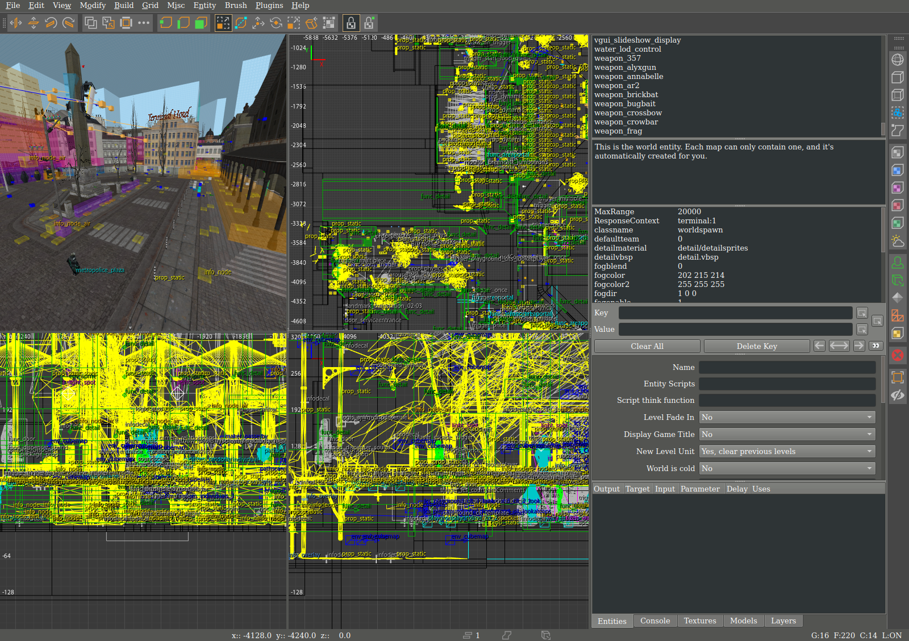

SourceRadiant
=================

The open-source, cross-platform level editor for Source Engine and GoldSrc based games.

SourceRadiant is a fork of NetRadiant-custom ([GtkRadiant](https://icculus.org/gtkradiant/) 1.4&rarr;massive rewrite&rarr;1.5&rarr;[NetRadiant](https://netradiant.gitlab.io/)&rarr;[NetRadiant-custom](https://github.com/Garux/netradiant-custom)&rarr;this)

## THIS PROJECT IS STILL IN AN EARLY ALPHA STATE!<br/>DO NOT OVERWRITE HAMMER-MADE VMFS WITH THIS!<br/>MAKE BACKUPS!



## Goals

- Become a viable Source Engine level editor beyond the novelty of making levels outside of Windows
- Stay in step with general editor changes from upstream [NetRadiant-custom](https://github.com/Garux/netradiant-custom)
- Disable any Radiant feature that is unrelated to Source Engine level editing
- Attempt to upstream any editor changes that are related to code cleanup and general usability improvements.

## Credits

- [sourcepp](https://github.com/craftablescience/sourcepp)
- [NetRadiant-custom](https://github.com/Garux/netradiant-custom)
- [MRVN-Radiant](https://github.com/MRVN-Radiant/MRVN-Radiant)
- [GtkRadiant](https://icculus.org/gtkradiant/)
- [FTEQW](https://github.com/fte-team/fteqw)

## Supported games

There are gamepacks for the following Source Engine and GoldSrc titles:

- Half-Life (1998)
- Half-Life 2 (2004)
- Half-Life 2: Deathmatch (2004)
- Vampire: The Masquerade - Bloodlines (2004)
- Counter-Strike: Source (2004)
- Day of Defeat: Source (2005)
- SiN Episodes: Emergence (2006)
- Garry's Mod (2006)
- Half-Life 2: Episode One (2006)
- Half-Life 2: Episode Two (2007)
- Portal (2007)
- Team Fortress 2 (2007)
- D.I.P.R.I.P. Warm Up (2008)
- Portal 2 (2011)

Note that any support for specific game or engine branch features should be
considered **!!EXPERIMENTAL!!**

## Features

### Can Do

- Load VMF maps
	- FIXME: Discards Displacements.
	- FIXME: Discards Visgroups.
	- FIXME: Discards some metadata, like `viewsettings` and `mapversion`.
	- FIXME: Discards Cordons.
	- FIXME: Discards Cameras.
	- FIXME: Discards VMF object IDs
- Save VMF maps
	- ~~FIXME: Sometimes solids are saved incorrectly and then the map won't compile.~~
	- FIXME: Needs to have a special case for not merging entity keys that start with "On", which are **always** Source Engine I/O outputs.
- Load VMT materials
	- ~~FIXME: Doesn't prioritize loading the `%tooltexture` VTF before `$basetexture`.~~
- Load VTF textures
- Load files from VPKs, GMAs and GCFs
	- FIXME: Doesn't support "old style" VPK layouts, like from Source SDK 2006.
	- ~~TODO: Support VTMB VPKs. They can already be loaded by sourcepp, but my code assumes that the filenames end with `_dir.vpk`, which the VTMB ones don't.~~
	- ~~TODO: Support Garry's Mod GMAs. They can already be loaded by sourcepp, but my code needs some adjustments for it to work right.~~
- Load MDL models
	- ~~FIXME: Only loads the first MDL surface, so some models are missing chunks.~~
- Compile Maps
- Load FGDs
	- FIXME: Only loads them from gamepacks directory.
	- ~~FIXME: Doesn't load choice/list keyvalues.~~
	- FIXME: Doesn't write default keyvalues to the saved map, like Hammer does.
	- ~~FIXME: Discards Source Entity I/O keys.~~

### Can't Do (yet):

- Displacements
	- Might be a tough challenge to modify Patch support into Displacement support. I was told that [FTEQW](https://github.com/fte-team/fteqw) has code for converting Displacements into Q3-style bezier curves.
- Source Entity I/O
	- Mostly a UI issue. In the short term it will be better to just document the plaintext format of I/O strings, and make sure they don't get merged in the saved VMF.
	- **NOTE**: All Source Entity I/O strings have the following format: `target,inputName,dataString,delayinSeconds,numUses`, so you could enter them manually as entity keys.
- Visgroups
	- May require some restructuring of Radiant internals to achieve. Radiant's "layers" system doesn't seem to be the same.
- Decals
	- Probably should look at [TrenchBroom](https://github.com/TrenchBroom/TrenchBroom/)'s implementation for reference.
- Instances

### To Do:

- Improve WAD handling for GoldSrc gamepacks
	- Allow you to choose which WADs get mounted instead of mounting all the ones it can find
	- Write `wad` keyvalue in the `worldspawn` entity so GoldSrc compile tools can work properly.
- Allow you to pick which texture directories to load (like TrenchBroom)
- Add read/write support of [J.A.C.K.](https://store.steampowered.com/app/496450/JACK/) map files for better GoldSrc developer interop
- Add read-only support of Worldcraft map files for loading legacy GoldSrc maps
- Simple prefab system
	- Support Worldcraft `.ol` prefab libraries
	- Support general prefabs loaded from a folder
- Parse TrenchBroom-specific map keys
	- Convert TrenchBroom map layers into Radiant map layers

### Random feature highlights

(Note that this feature list is copied entirely from [NetRadiant-custom](https://github.com/Garux/netradiant-custom))

* WASD camera binds
* Fully supported editing in 3D view (brush and entity creation, all manipulating tools)
* Uniform merge algorithm, merging selected brushes, components and clipper points
* Free and robust vertex editing, also providing abilities to remove and insert vertices
* UV Tool (edits texture alignment of selected face or patch)
* Autocaulk
* Model browser
* Brush faces extrusion
* Left mouse button click tunnel selector, paint selector
* Numerous mouse shortcuts (see help->General->Mouse Shortcuts)
* Focus camera on selected (Tab)
* Snapped modes of manipulators
* Draggable renderable transform origin for manipulators
* Quick vertices drag / brush faces shear shortcut
* Simple shader editor
* Texture painting by drag
* Seamless brush face<->face, patch<->face texture paste
* Customizable keyboard shortcuts
* Customizable GUI themes, fonts
* MeshTex plugin
* Patch thicken
* All patch prefabs are created aligned to active projection
* Filters toolbar with extra functions on right mouse button click
* Viewports zoom in to mouse pointer
* \'all Supported formats\' default option in open dialogs
* Opening *.map, sent via cmd line (can assign *.map files in OS to be opened with radiant)
* Texture browser: show alpha transparency option
* Texture browser: search in directories and tags trees
* Texture browser: search in currently shown textures
* CSG Tool (aka shell modifier)
* Working region compilations (build a map with region enabled = compile regioned part only)
* QE tool in a component mode: perform drag w/o hitting any handle too
* Map info dialog: + Total patches, Ingame entities, Group entities, Ingame group entities counts
* Connected entities selector/walker
* Build->customize: list available build variables
* 50x faster light radius rendering
* Light power is adjustable by mouse drag
* Anisotropic textures filtering
* Optional MSAA in viewports
* New very fast entity names rendering system
* Support \'stupid quake bug\'
* Arbitrary texture projections for brushes and curves
* Fully working texture lock, supporting any affine transformation
* Texture locking during vertex and edge manipulations
* Brush resize (QE tool): reduce selected faces amount to most wanted ones
* Support brush formats, as toggleable preference: Axial projection, Brush primitives, Valve 220
* Autodetect brush type on map opening
* Automatic AP, BP and Valve220 brush types conversion on map Import and Paste
* New bbox styled manipulator, allowing any affine transform (move, rotate, scale, skew)
* rendering of Q3 shader based skyboxes
* Incredible number of fixes and options

## Compiling

```bash
cmake -Bbuild -S.
cmake --build build
```

A fully prepared copy of the editor will be placed under the `install`
directory.
